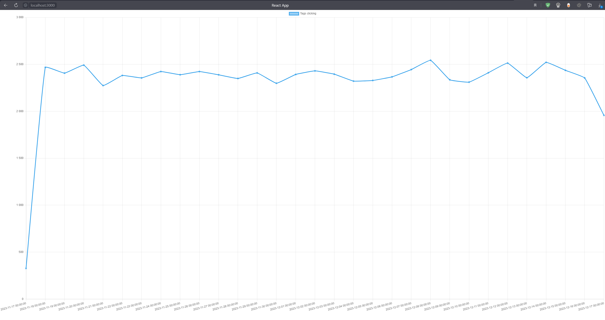
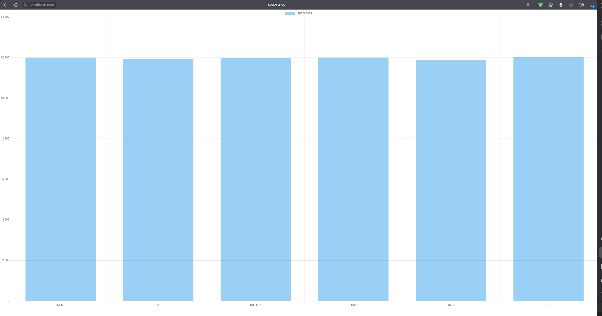

# Техническое Задание: MetStat

## Описание

MetStat - приложение для отслеживания и сбора данных о кликах пользователей на веб-страницах с последующим сохранением в ClickHouse для анализа поведения пользователей.

## Функциональные требования

### 1. Считывание кликов

- Приложение использует JavaScript для отслеживания кликов пользователя по элементам веб-страницы.
- Захват временной метки клика и целевого элемента.

### 2. Отправка данных на бэкэнд

- Реализовано API для передачи данных о кликах на бэкэнд.
- Формат данных: JSON с полями (id, tagName, className, textContent, timestamp).

### 3. Интеграция с ClickHouse

- Настройка взаимодействия с ClickHouse для хранения данных о кликах.
- Создание таблицы в ClickHouse с полями для хранения информации о кликах.
- Данные, полученные из бэкэнда, направляются в ClickHouse для хранения.

## Стек технологий

- **Spring Boot**: Фреймворк для создания веб-приложений на языке Java. Используется для реализации бэкэнд-части приложения, обработки запросов и взаимодействия с ClickHouse.

- **React**: JavaScript-библиотека для построения пользовательских интерфейсов. Применяется для разработки фронтенд-части приложения, в том числе для отображения данных о кликах.

- **Chart.js**: JavaScript-библиотека для построения графиков и диаграмм. Используется для визуализации аналитических данных, полученных из ClickHouse.

- **ClickHouse**: Колоночная система управления базами данных. Применяется для хранения данных о кликах пользователей, обеспечивая высокую производительность при анализе и запросах.

Этот стек технологий обеспечивает полное покрытие функционала приложения MetStat, начиная от отслеживания кликов на фронтенде с использованием React и Chart.js, до обработки и хранения данных на бэкэнде с использованием Spring Boot и ClickHouse.

## Примеры графиков

1. **График количества кликов**
	
2. **График популярности тэгов**
	